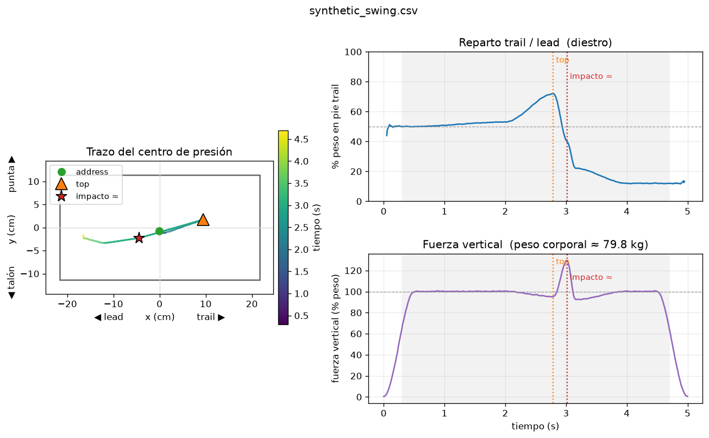

# Wii_Golf

Usar 1 o 2 **Wii Balance Boards** para medir la transferencia de peso y el
centro de presión (CoP) durante el swing de golf, y analizarlo con Python.

El contexto y la investigación previa (dispositivos comerciales, proyectos DIY,
arquitectura con 1 vs 2 tablas y matrices de presión) están en
[`docs/chat-sensores-presion-swing.md`](docs/chat-sensores-presion-swing.md).

## Estado

Funciona la cadena completa con **una** tabla en Windows: lectura HID a
~100 Hz, grabación a CSV y análisis del swing con métricas y gráficas.

```
wiigolf/
  balance_board.py          driver HID (init, calibración, lectura, CoP)
  analysis.py               análisis del swing: métricas, top/impacto, figura, referencia
  media.py                  micrófono y webcam en continuo; WAV + fotogramas JPEG; golpe a la bola
  bt_win.py                 emparejar/conectar la tabla por Bluetooth (API de Windows, sin apps)
scripts/
  01_detect.py              detecta la tabla, lee la calibración y comprueba la lectura
  02_live_read.py           lectura en vivo + grabación a CSV
  03_analyze.py             analiza un CSV y genera out/<nombre>.png
  04_web.py                 web local en tiempo real (CoP en vivo, grabación, captura automática)
  make_synthetic_swing.py   genera un swing sintético para probar sin la tabla
  wiigolf.bat               arranca el servidor y abre el navegador (doble clic)
  autostart.ps1             instala/quita la tarea que arranca el servidor al iniciar sesión
wiigolf/web/
  server.py                 FastAPI + WebSocket: lector, grabación, auto-captura, medios, API
  static/index.html         interfaz: CoP en vivo, swings, análisis, reproductor a cámara lenta
```

## Requisitos

- **Python 3.10+** en el PATH (probado con 3.14).
- Una Wii Balance Board **emparejada por Bluetooth** con el PC.
- `pip install -r requirements.txt` (`hidapi`, `numpy`, `matplotlib`, `fastapi`,
  `uvicorn`, y opcionales `sounddevice` para el micro y `opencv-python` para la webcam).

## Puesta en marcha (Windows / PowerShell)

```powershell
python -m venv .venv
.\.venv\Scripts\Activate.ps1
python -m pip install --upgrade pip
pip install -r requirements.txt
```

### Emparejar la tabla

1. Abre el compartimento de pilas de la tabla y pulsa el **botón rojo SYNC**
   (la tabla entra en modo emparejamiento durante ~20 s).
2. En *Configuración de Bluetooth* de Windows, añade el dispositivo
   **"Nintendo RVL-WBC-01"**. Si pide PIN, déjalo en blanco / omítelo.
3. Debe quedar como *conectado*. Se identifica como VID `0x057E` / PID `0x0306`.

### Prueba 1 - Detección

```powershell
python scripts/01_detect.py --led
```

- Lista los HID; la tabla aparece como VID `0x057E`.
- Con `--led`, el LED azul debe parpadear (confirma el canal de salida).
- Debe imprimir la calibración de fábrica y ~100 muestras/seg.

### Prueba 2 - Lectura en vivo y grabación

```powershell
python scripts/02_live_read.py --csv data/swing_001.csv --duration 15
```

Súbete a la tabla y verás el peso total y el CoP en vivo. Cada muestra se
guarda en el CSV (`t, TR, BR, TL, BL, total, cop_x, cop_y`). `Ctrl+C` detiene
la captura. La carpeta `data/` está en `.gitignore`.

### Prueba 3 - Análisis del swing

```powershell
python scripts/03_analyze.py data/swing_001.csv
```

Guarda `out/swing_001.png` con tres paneles (trazo del CoP sobre la silueta de
la tabla, % de peso en el pie trail vs tiempo, y fuerza vertical vs tiempo) con
las marcas de *address*, *top* e *impacto*, y muestra las métricas por consola:

| Métrica | Significado |
|---|---|
| `peso_corporal_kg` | mediana del peso mientras estás de pie (o fíjalo con `--bw 80`) |
| `trail_pct_en_top` | % del peso en el pie trail en el top del backswing |
| `lead_pct_en_impacto` | % del peso en el pie lead en el impacto (≈) |
| `pico_fuerza_pct_bw` | pico de fuerza vertical en % del peso corporal (empuje del downswing) |
| `top_a_impacto_ms` | duración del downswing |
| `cop_x_rango_cm`, `cop_longitud_trazo_cm` | amplitud lateral y longitud del trazo del CoP |

Opciones útiles:

- `--handed left` si eres zurdo.
- `--flip-x` si trail/lead salen invertidos (depende de hacia dónde mires en la
  tabla); `--flip-y` para punta/talón.
- `--top 2.80 --impact 3.02` para fijar las marcas a mano.
- `--show` abre la figura en una ventana.

#### Cómo se detectan el top y el impacto

- **Top**: máximo de carga en el pie trail justo antes del desplazamiento
  lateral más rápido hacia el lead (el downswing).
- **Impacto (≈)**: pico de fuerza vertical tras el top. El pico de fuerza de
  reacción vertical se produce al final del downswing, muy cerca del impacto,
  así que es una aproximación razonable con solo la tabla. Para un marcado
  fiable hará falta una señal externa sincronizada (micrófono o IMU); está en
  el roadmap.

### Probar sin la tabla

```powershell
python scripts/make_synthetic_swing.py
python scripts/03_analyze.py data/synthetic_swing.csv
```



### Prueba 4 - Web local en tiempo real

```powershell
python scripts/04_web.py
```

O doble clic en `scripts\wiigolf.bat` (arranca el servidor y abre el navegador).
Abre `http://localhost:8000` en el PC o la URL que imprime (`http://<ip>:8000`)
desde una **tablet o móvil en el mismo WiFi**. La primera vez Windows puede
pedir permiso en el firewall para `python.exe`; acéptalo para entrar desde la
tablet.

**En vivo**

- CoP con estela sobre la silueta de la tabla; el punto crece y se pone naranja
  cuando la fuerza vertical supera el 115 % del peso. Peso, fuerza (% del peso
  corporal) y barra trail / lead. *Fijar peso* toma la mediana estando quieto.
- **Tarar** con la tabla vacía (o con la alfombra encima); *quitar tara* deshace.
- **Micrófono** y **cámara**: se activan con sus casillas y capturan en continuo
  (buffer de 20 s) con el mismo reloj que la tabla. El medidor muestra el nivel
  del micro; *ver* enseña la cámara para encuadrar.

**Grabar swings**

- **Grabar / Detener y analizar**: un CSV por grabación, con audio y vídeo si
  están activos.
- **Captura automática**: sin pulsar nada entre swings. Dispara cuando el % de
  peso en el trail cae 25 puntos en < 0,5 s **y** hubo un pico de fuerza
  ≥ 112 % del peso en los 0,4 s previos (el rebote tras el swing no lo tiene);
  guarda 3 s antes + 1,5 s después y analiza al vuelo.
- Cada swing son varios archivos en `data/`: `<n>.csv` (tabla), `<n>.json`
  (meta y eventos), `<n>.wav` (audio), `<n>.frames.zip` (vídeo: un JPEG por
  fotograma con su instante) y `out/<n>.png` (figura).

**Impacto por audio**: si hay audio, se busca el golpe a la bola (transitorio
≥ 8× la mediana y nivel ≥ 0,02) en la ventana [top − 0,2 s, top + 1,2 s] y esa
marca sustituye a la estimación por fuerza. La lista muestra `impacto audio`.

**Reproductor a cámara lenta** (▶ en la lista o en el análisis): vídeo
fotograma a fotograma con el trazo del CoP superpuesto (recuadro de la tabla),
barra de tiempo con top / impacto / golpe, velocidades de 1× a 1/20×, avance
por fotograma (⏮ ⏭ o flechas, espacio = reproducir), *ir al top / impacto*, y
**marcar top / impacto aquí** para fijar las marcas a mano viendo el vídeo
(*restablecer marcas* vuelve al automático). Sin vídeo se reproduce el trazo.

**Swing de referencia**: ★ en un swing lo fija como base; los análisis
posteriores muestran sus métricas al lado con la diferencia (Δ), la figura
superpone la referencia en gris alineada en el impacto y el reproductor dibuja
su trazo y su punto a la vez que el del swing actual.

**Exportar / importar**: ⤓ descarga `<n>.wiigolf.zip` con todo (CSV, meta,
audio, vídeo, figura); *Importar zip* lo carga en otro PC (si el nombre ya
existe se renombra) y lo analiza.

**Tabla / Bluetooth** (botón de la cabecera): estado del adaptador y de la
tabla (conectada / emparejada), *Reconectar* y **Emparejar**: pulsa el botón
SYNC rojo de la tabla y luego el botón; se empareja con el PIN que espera la
tabla (la dirección del adaptador) y se activa su servicio HID, como hace
WiiPair, sin WiiBalanceWalker. Emparejada de forma permanente, basta con
encenderla: el servidor la detecta solo (reintenta cada 3 s).

**Arrancar como servicio** (siempre disponible, también para la tablet):

```powershell
powershell -ExecutionPolicy Bypass -File scripts\autostart.ps1 -Install
```

crea una tarea programada que arranca el servidor al iniciar sesión, oculto y
con reinicio automático si se cae (log en `data\server.log`); `-Uninstall` la
quita y `-Status` la consulta. Un navegador no puede lanzar procesos del PC,
así que esta es la forma de que la web "esté siempre"; la página se reconecta
sola cuando el servidor vuelve.

Para desarrollar sin la tabla: `python scripts/04_web.py --sim` reproduce en
bucle un swing simulado (el micro y la cámara sí son reales).

## Repartirlo como .exe (sin instalar Python)

Para que otra persona lo use en su PC con Windows sin instalar nada:

```powershell
powershell -ExecutionPolicy Bypass -File scripts\build_exe.ps1
```

Genera con PyInstaller la carpeta `dist\WiiGolf\` (`WiiGolf.exe` + `_internal\`
con Python y todas las dependencias + `LEEME.txt`) y la comprime en
`dist\WiiGolf-win64.zip` (~150 MB). Quien lo reciba solo descomprime y hace
doble clic en `WiiGolf.exe`: se abre la ventana del servidor y el navegador.
Los datos quedan en `data\` junto al exe. El zip no se versiona (`dist/` está
en `.gitignore`); se envía o se sube como *release* de GitHub.

- `WiiGolf.exe --check` muestra qué detecta ese PC (tabla, Bluetooth, micro,
  cámara) y dónde guarda los datos. Admite las mismas opciones que
  `04_web.py` (`--port`, `--sim`, `--no-browser`).
- El emparejado de la tabla se hace desde la propia web (botón *Tabla /
  Bluetooth* → *Emparejar*), así que en el otro PC no hace falta nada más.
- La receta está en `packaging\wiigolf.spec` (imports ocultos de uvicorn, la
  carpeta `static` de la web) y `packaging\launcher.py`; el texto para el
  usuario, en `packaging\LEEME.txt`.
- Windows SmartScreen/Defender puede avisar la primera vez porque el exe no va
  firmado: *Más información → Ejecutar de todas formas*.

## macOS (sin instalar Python)

No hace falta un Mac para construirlo: el workflow `.github/workflows/build.yml`
compila en GitHub Actions (runners de macOS con Xcode) en cada push a `main` y
deja los zips como artefactos (pestaña *Actions* → el run → *Artifacts*):

| Artefacto | Qué es |
|---|---|
| `WiiGolf-macos-arm64` | Wii Golf para Macs con chip Apple (M1 o posterior) |
| `WiiGolf-macos-x86_64` | Wii Golf para Macs Intel |
| `WiimotePair-BalanceBoard` | `WiimotePair.app` de Dolphin con el filtro de nombre ampliado a `RVL-*` para que acepte la Balance Board (GPL-2.0; se compila desde el original con un `sed` de una línea) |
| `WiiGolf-win64` | el exe de Windows, por si acaso |

Al empujar una etiqueta (`git tag v0.2.0 && git push --tags`) se publica una
*release* con los cuatro zips adjuntos, que es lo cómodo para enviar el enlace.
En un repo privado los minutos de macOS cuentan ×10 (unos 200 al mes gratis);
en uno público son ilimitados.

En el Mac (detallado en `packaging/macos/LEEME_MAC.txt`, que va en el zip):

1. Descomprimir; quitar la cuarentena de la descarga (`xattr -dr
   com.apple.quarantine <carpeta>` en Terminal, o *Privacidad y seguridad → Abrir
   de todos modos*) y doble clic en `Wii Golf.command`: abre Terminal con el
   servidor y el navegador. Aceptar los permisos de Bluetooth, micro y cámara
   que pida (van a Terminal).
2. **Emparejar la tabla**: la tabla exige un PIN de 6 bytes binarios (la
   dirección Bluetooth del Mac invertida) que Ajustes no puede escribir; por eso
   Ajustes la deja "conectada" sin exponer el HID. Nuestra app lo hace con
   `IOBluetoothDevicePair` (PyObjC, `wiigolf/bt_mac.py`) desde el panel *Tabla /
   Bluetooth → Emparejar* o con `./WiiGolf --pair`, y como plan B está
   `WiimotePair.app` (mismo método, en Objective-C). Con SYNC pulsado (LED
   parpadeando); después basta con encender la tabla.
3. `./WiiGolf --check` muestra qué detecta ese Mac.

Todo esto se ha escrito desde Windows: la app se prueba sola en el runner
(arranca, sirve la web, analiza), pero el emparejado real solo se puede validar
con la tabla en un Mac. Si falla, lo que hace falta es la salida de
`./WiiGolf --pair` y de `./WiiGolf --check`.

## Orientación sobre la tabla

- Colócate con los pies **a lo ancho** de la tabla: el eje x es el lateral
  (trail/lead) y el eje y es punta/talón.
- Un diestro mirando al frente de la tabla tiene el pie trail en x > 0. Si en
  tu montaje sale al revés, usa `--flip-x`.
- El stance cabe para hierros; con driver (stance más ancho que los 51 cm de la
  tabla) hace falta un tablero de contrachapado encima (diseño de la Univ. de
  Tennessee, ver docs) o la segunda tabla.

## Hallazgos hasta ahora

- **Windows 11 + Python 3.14 + `hidapi` funciona de principio a fin**: LED,
  init de la extensión, calibración de fábrica y streaming a ~99 Hz. No ha hecho
  falta la ruta Linux/xwiimote que se temía por la fragilidad histórica de los
  informes de salida HID en Windows.
- La calibración de fábrica (0 / 17 / 34 kg por sensor) se lee de la EEPROM de
  la tabla y las lecturas salen ya en kg.
- Con la tabla vacía el ruido es < 0,1 kg; por debajo de 2 kg el CoP se reporta
  como (0, 0) para no dividir entre ruido.
- Pipeline de análisis validado con un swing sintético: detecta el top
  (2,79 s vs 2,80 diseñado) y el impacto (3,02 s), pico de fuerza 129,5 % BW.
- **Cinco swings reales** (captura automática, 9/9/2026): top a ~2,8 s de la
  captura, 73-87 % de trail en el top, pico de fuerza **152-190 %** del peso y
  downswing de 180-220 ms. Obligaron a dos cambios: la máscara "de pie" del
  análisis pasó a ser relativa al peso corporal (el pico del 190 % y la descarga
  al 45 % rompían la anterior) y el disparador automático exige ahora también
  un pico de fuerza (el rebote tras el swing lo disparaba).
- La tabla ya está **emparejada de forma permanente** en Windows (autenticada
  con el adaptador): basta con encenderla, sin WiiBalanceWalker.

## Nota sobre Windows

Enviar informes de salida a dispositivos tipo Wiimote por la pila Bluetooth de
Windows es históricamente frágil. Aquí ha funcionado, pero si en otra máquina la
tabla se detecta y `01_detect.py` no recibe calibración/muestras, la vía más
robusta es **Linux o una Raspberry Pi** con `xwiimote`/`evdev` (cada tabla
aparece como un dispositivo independiente, ideal también para la fase de dos
tablas).

## Roadmap

1. ✅ Leer 1 tabla: CoP + peso a CSV.
2. ✅ Análisis del CSV: trazo del CoP, % trail/lead, fuerza vertical, marcas de
   top e impacto (heurístico).
3. ✅ Web local en tiempo real con grabación y captura automática.
4. ✅ Audio del golpe para marcar el impacto, vídeo de la webcam sincronizado,
   reproductor a cámara lenta con el trazo del CoP, swing de referencia,
   exportar/importar, emparejado Bluetooth propio y arranque como servicio.
5. Validar el impacto por audio con golpes reales y afinar umbrales; comparar
   varios swings superpuestos (consistencia).
6. **2 tablas** (una por pie) sincronizadas: CoP por pie y GRF vertical.
7. Matriz de presión (FSR/Velostat) sobre cada tabla para el mapa de presión.
